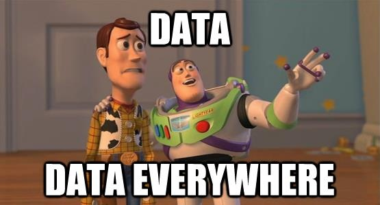
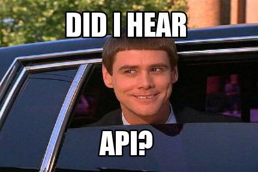
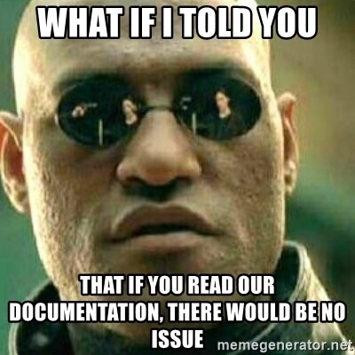
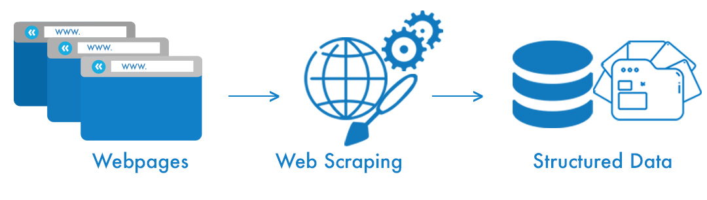
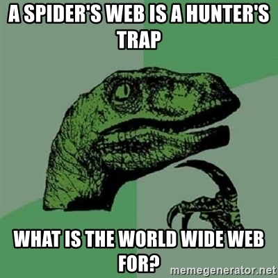

```{r setup, include=FALSE}
knitr::opts_chunk$set(echo = TRUE, warning = F, message = F)
```

## Overview

- Mainframes
  - APIs
  - Scrapers
  - Crawlers
- Exercises with the Reddit API
- Web ontology
- Exercise with Google Scholar

## The World Wide Web
<br>
<br>
```{r, out.width = "600px", echo =FALSE, fig.align='center'}

```

# Mainframes

## API
- Application Programming Interface: provided by a host (company, etc.)
  - send query
  - receive response
- Popular: Reddit, Twitter, Openmap
- Often requires authorization parameters -> make developer profile
- Very easy to handle
  - Responses have identical structure
  - Response contains all available data
  - No need to know anything about web ontology
  
## API - anyone?

<br>
```{r, out.width = "600px", echo =FALSE, fig.align='center'}

```

## API? Doesn't work...

<center>



</center>

## Web scraping 
<br>
<br>
<br>
```{r, out.width = "600px", echo =FALSE, fig.align='center'}

```

## Scrapers

- Code to automatically extract user-defined data from webpages
- Runs over pre-defined set of URLs
- Static components:
  - Extracts the same content across pages
- Dynamic components: 
  - Adapts what is extracted based on structure of page and availability of data
- User needs to be familiar with information storage on pages

## Crawler
- Code
  - that extracts links from an initial page 
  - cycles over all links `x...z`
    - extract all links from `x`
    - cycles over all links in `x`
    ...
- Usually contains domain-restrictions 
  - don't follow up on ads, etc.
- Always combined with scraper-elements to extract data
- User needs to be familiar with dynamic information retrieval techniques

## Be the spider!

<center>



</center>

# Let's try it!

# Web ontology

## The Family
```{r, out.width = "800px", echo =FALSE, fig.align='center'}
knitr::include_graphics("../../res/p/html_css.png")
```

## HTML / CSS
- Content that is "hard-coded"
- Elements
  - have tags: `<body>, <div>, <p>, <span>, ...`
  - can have classes: `<p class = "textElement">Hi!</p>`
  - can have IDs: `<p id = "byebye">Bye!</p>`
  - can have a variety of attributes:
    - `<a href = "https://www.whatever.com">Whatever</a>`
    - ...
- Elements can be targeted via 
  - css selectors
  - xpath

## JavaScript
- Content that is generated dynamically
- To extract data, webpage needs to be loaded in a browser session
- Dynamically created HTML-content can be targeted as before, as soon as page is loaded
- Pure JS-content has to be targeted via JS-injection
- More advanced stuff!

# Back to R!
  


