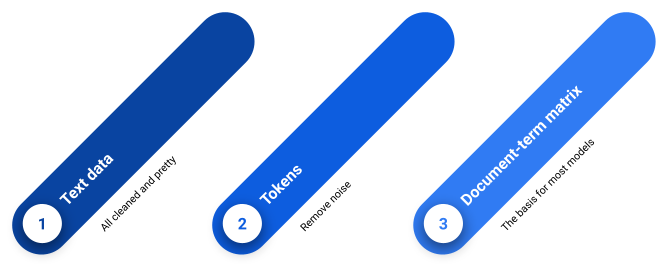
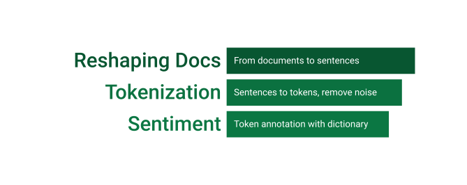

```{r setup, include=FALSE}
options(width = 999)
knitr::opts_chunk$set(echo = TRUE, warning = FALSE, message = FALSE)
#library(devtools)
#install_github("holtzy/epuRate")
library(epuRate)
library(rmarkdown)
```

<link rel="stylesheet" href="styles.css">


<div style="text-align:center;padding-top:20">

</div>
<br>
<br>

This script runs without external data, except for quanteda-inherent files. If you have trouble setting your working directory, please use Slack and we will try to help you to be ready for the next session, in which we will have to load external data.

## Packages
```{r message=FALSE}
## load required libraries
library(tidyverse)
library(quanteda)
library(lexicon)
library(reshape2)
library(stringi)
library(quanteda.textplots)
library(gridExtra)
```
```{r}
## clean workspace
rm(list=ls())
```


## Clean workspace and set working directory

This step is only for those who use their own corpora.

```{r eval=FALSE}
## set working directory (WD)
path <- '~/coliphi21/practice_lessons/lesson_1/src/'
setwd(path)
## Quickfix: setwd(dirname(rstudioapi::getActiveDocumentContext()$path))
```

## Import data

For this tutorial we will use the `quanteda`-corpus `data_corpus_inaugural` containing the inaugural addresses of US presidents since 1789. For the next session, you will be able to work with your own data.

```{r}
df <- data_corpus_inaugural
```

## Inspect data
```{r}
## how does the corpus object look like?
df
## summary statistics
summary(df) %>% head
## what object class is the object?
class(df)
## how much space does it use?
object.size(df)
## what does data structure look like?
str(df)
```

## Interacting with the data
### Document variables
```{r}
## the document-level variables
docvars(df) %>% head
?table
```

#### > Exercise {.tabset .tabset-fade}
##### Task
Compute the number of Democrat and Republican speeches. Hint: checkout the `table`-function.

##### Solution
```{r}
table(df$Party)
```


### Selecting documents
```{r}
## text data: how can we look at Biden's 2021 speech?
txt <- as.character(df)
names(txt)
## subsetting data by logical vectors
c('hi', 'hello', 'bye')[c(TRUE, FALSE, TRUE)]
c('hi', 'hello', 'bye')[c(TRUE, FALSE, TRUE, TRUE)]
c('hi', 'hello', 'bye')[c(TRUE, FALSE)]
biden <- txt[grepl('Biden', names(txt))]
cat(biden)
## subsetting by name
# select Washington's 1789 speech to compare
cat(txt['1789-Washington'])
```

#### > Exercise {.tabset .tabset-fade}
##### Task
Extract both the Trump and Biden speech at the same time. Hint: `|` means OR in regex-functions, such as `grepl`.

##### Solution
```{r}
l <- txt[grepl('Biden|Trump', names(txt))]
l
str(l)
```

### Word tokens and the document-term matrix

<div style="text-align:center;padding-top:10px;margin-bottom:-80px">

</div>
<br>
<br>

```{r}
## word tokenization
?tokens
?dfm
toks <- tokens(df, remove_punct = T, remove_symbols = T, padding = F)
toks
## document-term matrix
dfx <- dfm(toks)
dfx
```

#### > Exercise {.tabset .tabset-fade}
##### Task
Remove numbers (part of the noise) from the tokens. Hint: Checkout the `tokens`-function.

##### Solution
```{r eval=FALSE}
toks <- tokens(df, remove_punct = T, remove_symbols = T, padding = F, remove_numbers = T,
               remove_url = T, remove_separators = T)
dfx <- dfm(toks)
```


### Top features
```{r}
## top 10 features for every document
topfeatures(dfx, n = 10, groups = docnames(dfx))
## ugh, not very informative...
```

```{r}
## let's remove stopwords before creating a document-term matrix
## this is done during tokenization
stopwords('en')
sel_toks <- tokens_select(toks, pattern = stopwords("en"), selection = "remove")
dfx <- dfm(sel_toks)
```

#### > Exercise {.tabset .tabset-fade}

##### Task
Remove additional words that are not part of the stopwords-vector, such as "much", "every", and "never". Hint: Two or more vectors can be concatenated by putting them into one and the same vector.

##### Solution
```{r}
?tokens_select
sel_toks <- tokens_select(toks, pattern = c(stopwords("en"), 'every', 'never'), selection = "remove", valuetype = "glob")
```


### Now let's have a look at it again:

```{r}
# again: 10 features for every document, now without stopwords
topfeatures(dfx, n = 10, groups = docnames(dfx))
# we can also compute topfeatures by any docvar
docvars(dfx)
topfeatures(dfx, n = 10, groups = Party)
```

#### > Exercise {.tabset .tabset-fade}

##### Task
Print topfeatures per President.

##### Solution
```{r}
topfeatures(dfx, n = 10, groups = President)
```


## Level of analysis: sentence
Sometimes we want to analyze certain indicators on sentence-level. To show how to go about doing so, we will compute the per-sentence sentiment in Biden's 2021 speech.

<div style="text-align:center;padding-top:10px;margin-bottom:-80px">

</div>

### Reshape, Subset and Prepare Documents
```{r}
## first step: extract Biden's speech from the corpus
biden <- corpus_subset(df, President == 'Biden')
## 2nd step: reshape corpus from full texts to sentences
sentences <- corpus_reshape(biden, to = 'sentences')
sentences
## 3rd step: within-sentence word tokenization
# tokenize
sentence_toks <- tokens(sentences, what = 'word',  remove_punct = T)
# make lower case
sentence_toks <- tokens_tolower(sentence_toks)
# remove stopwords
sentence_toks <- tokens_select(sentence_toks, pattern = stopwords("en"), 
                               selection = "remove")
```

### Sentiment annotation
```{r}
## select a sentiment dictionary
## we use the Proksch et al. (2015 dictionary native to quanteda)
data_dictionary_LSD2015
## apply dictionary to the Biden's speech
toks_lsd <- tokens_lookup(sentence_toks, dictionary = data_dictionary_LSD2015[1:2])
dfm_lsd <- dfm(toks_lsd)
## compute percentage of positive words per sentence
## over the course of the speech
# melt dfm to long table
df_lsd <- convert(dfm_lsd, to = "data.frame")
df_lsd
df_lsd <- melt(df_lsd, id.vars = 'doc_id', variable.name = 'sentiment', value.name = 'n')
head(df_lsd)
# group by sentence (doc_id) and compute percentages
df_lsd <- df_lsd %>% 
  group_by(doc_id) %>% 
  mutate(perc = n/sum(n))
head(df_lsd)
# give every sentence a numeric value corresponding to doc ID
df_lsd <- df_lsd %>% 
  ungroup %>% 
  mutate(num_id = as.numeric(stri_extract(doc_id, regex = '(?<=\\.)[0-9]+')))
```

### Visualization 
```{r fig.align='center'}
## plot results
ggplot(data = df_lsd, aes(x = num_id, y = perc, colour = sentiment, 
                          group = sentiment)) +
  geom_smooth() +
  #geom_point(alpha = 0.5) +
  theme_classic() +
  theme(plot.title = element_text(face = 'bold')) +
  scale_x_continuous(expand = c(0, 0)) +
  scale_y_continuous(expand = c(0.01, 0.01), labels = scales::percent) +
  labs(
    title = "Biden's 2021 speech: sentiment per sentence, smoothed",
    x = 'Sentence Number Within Speech',
    y = 'Frequency'
  )
## inspect sentence-tokens vectors 55-65
sentence_toks[55:65]
## uh.. this doesn't look like it's meant negatively.
## let's double check by reading the untokenized sentences
sentences[55:65]
## as expected, Biden is mentioning ISSUES, but in a combative way
```

## Level of analysis: token windows
Let's compare the word embeddings for 'progress', 'spirit', 'world', 'nation', 'duty', and 'war' 
between Democrats and Republicans. We define the embedding as a window of +/-10 words around these keywords.

<div style="text-align:center;padding-top:0px;margin-bottom:-120px">

</div>

### Prep
```{r}
## tokenization
toks <- tokens(df, remove_punct = T, remove_symbols = T, padding = F)
toks <- tokens_replace(toks,
                       pattern = '\\bUS\\b',
                       replacement = 'USA')
toks <- tokens_tolower(toks)
## lemmatizing
toks <- tokens_replace(toks, 
                       pattern = lexicon::hash_lemmas$token, 
                       replacement = lexicon::hash_lemmas$lemma)
## remove stopwords stopwords
# custom stopwords
cstmwrds <- c('upon', 'can', 'us', 'let', 'may', 'us', 'make',
              'must', 'many', 'shall', 'without', 'among',
              'much', 'every', 'ever', 'know', 'new', 'never',
              'year', 'find', 'see', 'good')
# remove them all
toks <- tokens_select(toks,  pattern = c(stopwords("en"), cstmwrds), 
                      selection = "remove")
## define the keywords
query <- c('progress', 'spirit', 'world', 'nation', 'duty', 'war')
```

### Feature co-occurence matrix for 'duty'
```{r}
## subset data by the party-affiliation
demo <- tokens_subset(toks, Party == 'Democratic')
repub <- tokens_subset(toks, Party == 'Republican')
## select tokens within +/- 10 words around the keyword 'duty'
toks_demo <- tokens_select(demo, pattern = 'duty', selection = "keep", 
                           window = 10, padding = FALSE, verbose = TRUE)
toks_repub <- tokens_select(repub, pattern = 'duty', selection = "keep", 
                            window = 10, padding = FALSE, verbose = TRUE)
## create feature co-occurence matrix (fcm) with weights within the window
## the more distance between the words, the less weight the co-occurence gets
dfcmat_demo <- fcm(toks_demo, context = 'window', window = 10, 
                   count = 'weighted', tri = FALSE)
dfcmat_repub <- fcm(toks_repub, context = 'window', window = 10, 
                    count = 'weighted', tri = FALSE)
dfcmat_demo # have a look at one of the fcms
## subset the fcm, by selecting those top 50 terms
dfcmat_demo <- fcm_select(dfcmat_demo, 
                          pattern =  names(topfeatures(dfcmat_demo, 51)), 
                          selection = "keep")
dfcmat_repub <- fcm_select(dfcmat_repub, 
                           pattern =  names(topfeatures(dfcmat_repub, 51)), 
                           selection = "keep")
```

### Visualization
```{r fig.height=5, fig.width=10, fig.align='center'}
## compute varying word-label sizes for each term based on its frequency
label_sizes_demo <- rowSums(dfcmat_demo)/min(rowSums(dfcmat_demo))*1.2
## override the size for the term in <i> (cannibalizes the whole space of the plot)
label_sizes_demo['duty'] <- 0.1
set.seed(123) # set seed for repoducibility
p_demo <- quanteda.textplots::textplot_network(dfcmat_demo, 
                                              min_freq = 0.5,
                                              edge_alpha = 0.2,
                                              vertex_size = 
                                                rowSums(dfcmat_demo)/min(rowSums(dfcmat_demo))/8,
                                              vertex_labelsize = label_sizes_demo,
                                              edge_color = 'dodgerblue') + 
      # additional theme tweaks
      labs(title = 'Democratic: duty') +
      theme(plot.title = element_text(face = 'bold'))
## same for republicans
label_sizes_repub <- rowSums(dfcmat_repub)/min(rowSums(dfcmat_repub))*1.2
label_sizes_repub['duty'] <- 0.1
p_repub <- quanteda.textplots::textplot_network(dfcmat_repub, 
                                              min_freq = 0.5,
                                              edge_alpha = 0.2,
                                              vertex_size = 
                                                rowSums(dfcmat_repub)/min(rowSums(dfcmat_repub))/8,
                                              vertex_labelsize = label_sizes_repub,
                                              edge_color = 'firebrick') + 
      # additional theme tweaks
      labs(title = 'Republican: duty') +
      theme(plot.title = element_text(face = 'bold'))
## plot
grid.arrange(p_demo, p_repub, ncol = 2)
```

### Serialize with a loop
```{r fig.height=20, fig.width=10, fig.align='center'}
## feature co-occurence matrix
container <- list() # plot-container
for(m in c('Democratic', 'Republican')){ # loop over party
  for(i in query){ # loop over keywords
    ## subset data by the party-affiliation in <m>
    toks_sel <- tokens_subset(toks, Party == m)
    ## select tokens within +/- 10 words around the keyword in <i>
    toks_sel <- tokens_select(toks_sel, pattern = i, selection = "keep", window = 10, 
                              padding = FALSE, verbose = TRUE)
    ## create feature co-occurence matrix (fcm) with weights within the window
    ## the more distance between the words, the less weight the co-occurence gets
    dfcmat <- fcm(toks_sel, context = 'window', window = 10, 
                  count = 'weighted', tri = FALSE)
    ## extract the names of the 50 top co-occurences in the embedding for the term in <i>
    feat <- names(topfeatures(dfcmat, 51))
    ## subset the fcm, by selecting those top 50 terms
    dfcmat_sel <- fcm_select(dfcmat, pattern = feat, selection = "keep")
    ## create plot
    # compute varying word-label sizes for each term based on its frequency
    label_sizes <- rowSums(dfcmat_sel)/min(rowSums(dfcmat_sel))*0.8
    # override the size for the term in <i> (cannibalizes the whole space of the plot)
    label_sizes[i] <- 0.1
    set.seed(123) # set seed for repoducibility
    p <- quanteda.textplots::textplot_network(dfcmat_sel, 
                                              min_freq = 0.5,
                                              edge_alpha = 0.2,
                                              vertex_size = 
                                                rowSums(dfcmat_sel)/min(rowSums(dfcmat_sel))/8,
                                              vertex_labelsize = label_sizes,
                                              edge_color = 
                                                ifelse(m=='Republican', 
                                                       'firebrick', 
                                                       'dodgerblue')) + 
      # additional theme tweaks
      labs(title = paste0(m, ': ', i)) +
      theme(plot.title = element_text(face = 'bold'))
    ## populate the container
    container[[paste0(m, ': ', i)]] <- p 
  }
}
## plot panel
names(container)
grid.arrange(container[[1]], container[[7]], 
             container[[2]], container[[8]], 
             container[[3]], container[[9]],
             container[[4]], container[[10]], 
             container[[5]], container[[11]], 
             container[[6]], container[[12]],
             ncol = 2)
```


